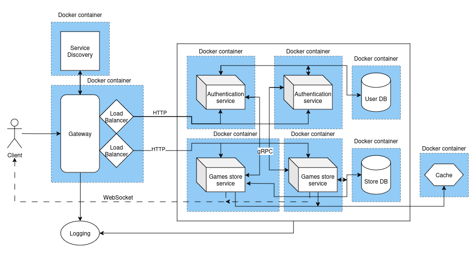

# SIR0

## Project Description
A games distribution platform with games store and authentication features.

## Application Suitability
### ✔ Relevance
- Growing Digital Gaming Market Demand
- Convenience and Accessibility
- Seamless Payment and Acquisition
- Seamless, Fast, and Reliable Experiences
- Revenue Opportunities

### ✔ Why microservices are necessary
- Continuous Deployment and Updates
- Customization and Extensibility
- Complexity Management

### ✔ Real-World Examples
#### 🕹️ Steam
- Catalog Management: Steam’s store microservice handles the vast catalog of games, DLCs, and other digital content. 
- Purchasing and Ownership: Once a user purchases a game, this microservice communicates with Steam’s user accounts service to update the user’s library, allowing them to download and install their purchase.
- Steam Guard: Steam uses a dedicated microservice for authentication, including features like Steam Guard (two-factor authentication).

#### 🎮 Epic Games Store
- Digital Distribution and Purchasing: The Epic Games Store provides a games store microservice that handles game listings, sales, and distribution. This microservice also tracks when users redeem free games or claim offers.
- Epic Account Services: Epic has a dedicated authentication microservice known as Epic Account Services. It allows players to log in to both the Epic Games Store and any games using Epic’s login infrastructure (e.g., Fortnite, Rocket League).

----

## Service Boundaries
### ✔ System Architecture Diagram


----

## Technology Stack and Communication Patterns
### ✔ Tech Stack
- #### Programming Languages
    - Python
    - JavaScript

- #### Database
    - PostgreSQL

- #### Frameworks
    - Flask
    - NestJS

- #### Environments
    - NodeJS

- #### Deployment
    - Docker
    - Docker compose

- #### Communication
    - HTTP/REST
    - gRPC
    - Postman
    - Swagger

- #### Caching
    - Redis

### ✔ Communication Patterns
- #### Synchronous
    - Microservices communicate via **_RESTful APIs_**, sending **_HTTP_** requests and receiving responses.
    - **_gRPC_** offers a more efficient binary protocol and is suitable for high-performance, low-latency communication between services.

- #### Asynchronous
    - **_WebSocket_** can be used to propagate events (like state changes or notifications) to clients in real-time. When a new game update or feature is released, the game store microservice could send a message to a WebSocket server. Connected clients receive the update instantly without polling the server.

----

## Data Management
Each microservice will have it's separate database in PostgreSQL, resulting in each service having exclusive access to its data.

### ✔ Models
- #### User
    ```json
        {
            "userId": "int",
            "username": "string",
            "email": "string",
            "password": "string"
        }
    ```
- #### Game
    ```json
        {
            "gameId": "int",
            "title": "string",
            "genre": "string",
            "price": "float",
            "description": "string"
        }
    ```
### ✔ Endpoints
- ### *GET /api/status*
    - #### Response
        - ##### 200 OK
            ```json
                {
                    "service": "string",
                    "status": "OK",
                    "timestamp": "timestamp"
                }
            ```
        - ##### 500 Internal Server Error
            ```json
                {
                    "service": "string",
                    "status": "ERROR",
                    "timestamp": "timestamp",
                    "details": "string"
                }
            ```    

----

- ### *POST /api/users/register*
    - #### Request Body
    ```json
            {
                "username": "string",
                "email": "string",
                "password": "string"
            }
    ```        

    - #### Response
        - ##### 200 OK
            ```json
                {
                    "message": "User registered successfully",
                    "username": "string"
                }
            ```    
        - ##### 400 Bad Request
            ```json
                {
                    "error": "string",
                    "details": "string"
                }
            ```    

- ### *POST /api/users/login*
    - #### Request Body
        ```json
            {
                "email": "string",
                "password": "string"
            }
        ```    

    - #### Response 
        - ##### 200 OK
            ```json
                {
                    "message": "Login successful",
                    "token": "string"
                }
            ```    
        - ##### 401 Unauthorized
            ```json
                {
                    "error": "Invalid credentials"
                }
            ```    

- ### *POST /api/users/logout*
    - #### Request Body
        ```json
            {
                "token": "string"
            }
        ```    

    - #### Response
        - ##### 200 OK
            ```json
                {
                    "message": "Logout successful"
                }
            ```    
        - ##### 400 Bad Request
            ```json
                {
                    "error": "string",
                    "details": "string"
                }   
            ```    
- ### *PUT /api/users/{user_id}*
    - #### Headers
            Authorization: Bearer \<token>

    - #### Request Body
        ```json
            {
                "username": "string",
                "email": "string",
                "password": "string"
            }
        ```    

    - #### Response
        - ##### 200 OK
            ```json
                {
                    "message": "Profile updated successfully"
                }
            ```    
        - ##### 400 Bad Request
            ```json
                {
                    "error": "string",
                    "details": "string"
                }   
            ```    
        - ##### 404 Not Found
            ```json
                {
                    "error": "User not found"
                }   
            ```                 

----

- ### *GET /api/games*
    - #### Response
        - ##### 200 OK
            ```json
                {
                    "games": [
                        {
                        "gameId": "int",
                        "title": "string",
                        "genre": "string",
                        "price": "float",
                        "description": "string"
                        }
                    ]
                }  
            ```       

- ### *GET /api/games/{id}*
    - #### Response
        - ##### 200 OK
            ```json
                {
                    "gameId": "int",
                    "title": "string",
                    "genre": "string",
                    "price": "float",
                    "description": "string"
                }
            ```    
        - ##### 404 Not Found
            ```json
                {
                    "error": "Game not found"
                }
            ```                

- ### *POST /api/games*
    - #### Request Body
        ```json
            {
                "title": "string",
                "genre": "string",
                "price": "float",
                "description": "string"
            }
        ```    

    - #### Response
        - ##### 201 Created
            ```json
                {
                    "message": "Game added successfully",
                    "title": "string"
                }
            ```    
        - ##### 400 Bad Request
            ```json
                {
                    "error": "string",
                    "details": "string"
                }    
            ```    

- ### *PUT /api/games/{id}*
    - #### Request Body
        ```json
            {
                "title": "string",
                "genre": "string",
                "price": "float",
                "description": "string"
            }
        ```    

    - #### Response
        - ##### 200 OK
            ```json
                {
                    "message": "Game updated successfully"
                }
            ```    
        - ##### 404 Not Found
            ```json
                {
                    "error": "Game not found"
                }  
            ```    

- ### *DELETE /api/games/{id}*
    - #### Response
        - ##### 200 OK
            ```json
                {
                    "message": "Game deleted successfully"
                }
            ```    
        - ##### 404 Not Found
            ```json
                {
                    "error": "Game not found"
                }    
            ```    

----

- ### Subscription Messages
    1. #### Subscribe to a Game
    - #### Client to Server
        ```json
        {
            "action": "subscribe",
            "topic": "game_updates"
        }
        ```

    - #### Server Response
        ```json
        {
            "message": "Subscribed to game_updates"
        }
        ```
    2. #### Unsubscribe from a Game

    - #### Client to Server
        ```json
        {
            "action": "unsubscribe",
            "topic": "game_updates"
        }
        ```

    - #### Server Response
        ```json
        {
            "message": "Unsubscribed from game_updates"
        }
        ```

----

## Deployment and Scaling
**_Docker_** will be used to have each service with it's database deployed in a container and using Docker compose to set up a default network for the services, allowing them to communicate using service names. Using Docker containers to have specific environments for the services. Docker will build, start and check the status of each microservice. This approach makes sure that the services can run on any machine and are compatible.

The scaling method I will be using is **_horizontal scaling_** to make use of more service instances. Horizontal scaling involves adding more instances of a service to handle increased load. This is beneficial because it allows the system to handle more requests by distributing the load across multiple instances, ensuring efficient use of resources and improved performance.

## References
- [System Architecture](https://medium.com/@beuttam/building-scalable-microservices-with-proxy-load-balancer-api-gateway-private-network-services-f25c73cc8e02)
- [Service Discovery](https://www.consul.io/)
- [Horizontal Scaling](https://www.cloudzero.com/blog/horizontal-vs-vertical-scaling/)
- [Gateway](https://docs.nestjs.com/websockets/gateways)
- [Microservices using Docker](https://middleware.io/blog/microservices-architecture-docker/)
- [Unit Testing](https://codethechange.stanford.edu/guides/guide_flask_unit_testing.html)